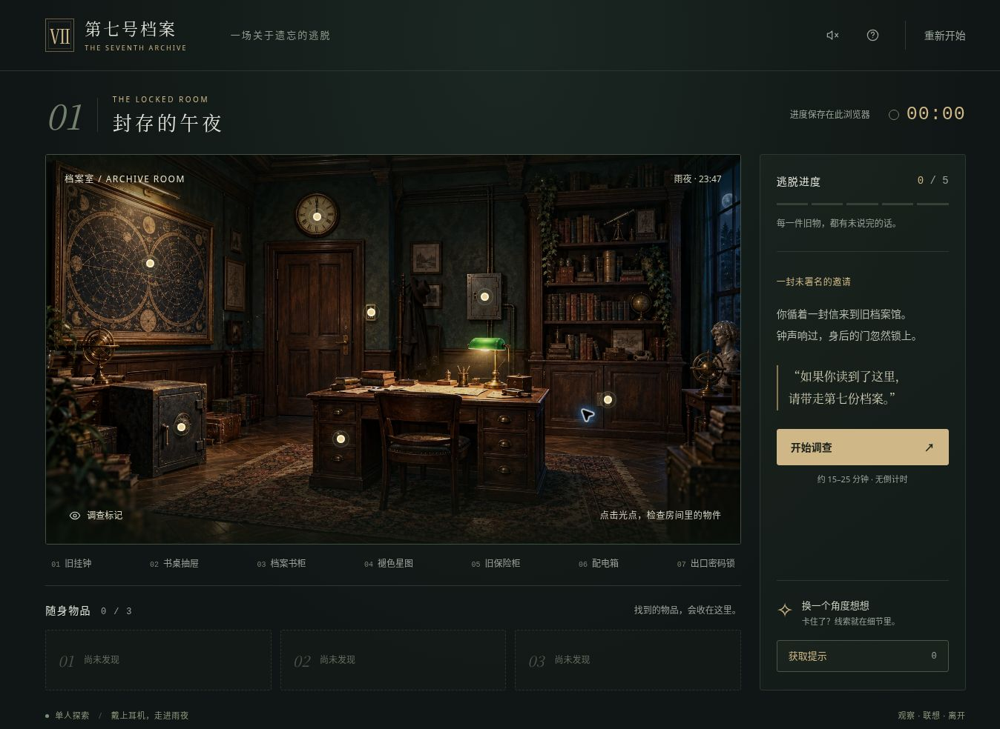
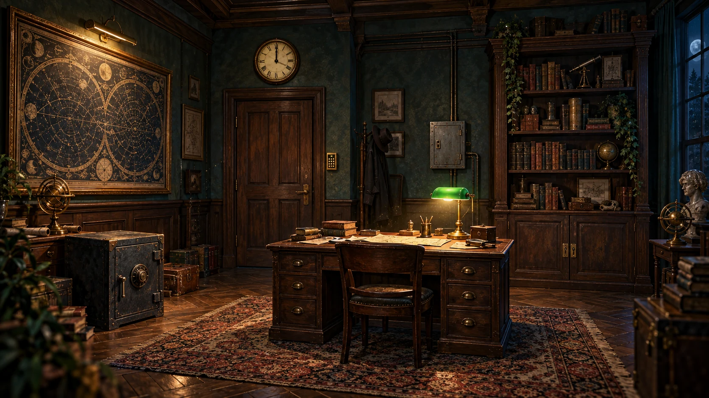

# 第七号档案 · The Seventh Archive 3D

一封没有署名的邀请，一间午夜上锁的档案室。控制调查员走进雨夜，寻找线索，带着第七份档案离开。

**[在线游玩：第七号档案 · 3D 雨夜密室](https://fuzzylogic112.github.io/seventh-archive/)**



## 现在是可以走动的 3D 密室

- 第三人称人物探索，带行走动画、跟随镜头、手电筒和家具碰撞。
- 必须走近物件才能调查；收集钥匙、紫外线手电和保险丝，完成五道连贯机关。
- 抽屉、柜门和出口随解谜进度打开，供电后房间和密码锁发生变化。
- 轻度恐怖：敲门声、灯光渐暗、短暂的人影；无血腥和追杀，可随时关闭。
- 电脑键盘 / 鼠标操作，手机虚拟摇杆与拖动转向。
- 线索手记、三级提示、自动存档。兼容原版谜题存档，额外保存人物位置与偏好。
- Three.js 与场景一起打包到本站，不请求海外 CDN、在线字体、模型或音效接口。
- 支持图形加速时使用 WebGL 2；不可用时自动使用软件 3D 渲染，仍可移动和解谜。
- 雨声、脚步和机关音由 Web Audio 合成，默认静音，由玩家主动开启。

这是单章节、固定谜题的完整可玩版本。无需账号或服务器，存档保存在当前浏览器；没有多人联机、云存档或在线排行榜。

## 操作

| 操作 | 电脑 | 手机 |
| --- | --- | --- |
| 移动人物 | WASD / 方向键，或左下角方向按钮 | 拖动左下角摇杆 |
| 转动镜头 | 拖动场景；Q / R 也可转向 | 在场景空白处拖动 |
| 调查附近物件 | E / 点击下方调查按钮 | 点调查按钮 |
| 选择道具 | 点击下方物品栏 | 点物品栏 |
| 快走 | Shift + 移动 | — |
| 开关手电 | F / 顶部手电按钮 | 顶部手电按钮 |
| 线索手记 | J / 右上方手记按钮 | 手记按钮 |
| 重置视角 | V / 小地图右下角按钮 | 设置中可回到入口 |
| 关闭窗口 | Esc / 关闭按钮 | 关闭按钮 |

右上角的设置可以关闭恐怖效果、切换画质、隐藏调查标记，或保留线索回到入口。设备开启“减少动态效果”时，首次进入默认关闭恐怖效果。

## 本地运行

直接打开 `dist/index.html` 即可运行已打包的版本。若希望稳定保存进度，建议使用 HTTP 服务；不同浏览器对 `file://` 存储的支持不同。

安装 Node.js 22+ 后：

```bash
npm start
```

打开 `http://localhost:4173`。只运行已经打包的游戏，无需安装 npm 依赖。

## 修改与构建

```bash
npm ci
npm run build
npm run check
npm test
npm start
```

`src/room.js` 是可编辑的 Three.js 场景与人物控制源码；构建会把它和渲染库打包到 `dist/room.bundle.js`。修改 3D 源码后必须重新构建。

| 文件 | 用途 |
| --- | --- |
| `src/room.js` | 3D 房间、人物、灯光、动画、镜头与输入 |
| `src/software-renderer.js` | 无 WebGL 环境的透视投影与深度缓冲兼容渲染 |
| `dist/navigation.js` | 房间布局、碰撞、距离调查、人物存档校验 |
| `dist/engine.js` | 机关规则、道具、线索、提示与谜题存档 |
| `dist/app.js` | 调查窗口、游戏界面、设置、声音与状态同步 |
| `dist/index.html` / `dist/styles.css` | 界面、手机布局和摇杆 |
| `scripts/build.mjs` | 使用锁定版本的 esbuild 打包 3D 场景 |
| `tests/` | 谜题、移动碰撞、可达性和发布工具测试 |

普通解谜存档继续使用 v1 格式；人物位置与显示偏好独立保存。新增剧情或修改机关依赖时，请同步更新存档校验和测试。

## GitHub Pages 发布

本站已经部署在 [GitHub Pages](https://fuzzylogic112.github.io/seventh-archive/)。

Fork 或另建仓库时，将 **Settings → Pages → Source** 设为 **GitHub Actions**。推送到 `main` 后，工作流会安装锁定的构建工具、构建 3D 场景、检查资源与规则，然后只发布 `dist/`。

完整步骤见 [部署指南](docs/DEPLOY.md)。Windows 本机发布助手仍可用于创建一个新的公开仓库，说明见 [Windows 发布指南](docs/DEPLOY-WINDOWS.md)。

游戏运行时所有资源都在同一站点。GitHub Pages 的网络可达性仍取决于玩家网络；同一份 `dist/` 也可放到其他静态主机。

## 素材与许可

项目代码采用 [MIT License](LICENSE)。Three.js 的 MIT 许可随包保留于 [THREE-LICENSE.txt](dist/vendor/THREE-LICENSE.txt)。人物、家具、图案和声音由项目代码生成；原版背景图片的来源说明保留在 [ASSETS.md](ASSETS.md)。


<sub>原点击式版本使用的档案室背景（AI 生成，3D 版已改为代码建模，不再使用此图）</sub>

源码包含解谜答案，适合休闲游戏与前端学习。欢迎提交错误报告、操作体验反馈和新章节。
